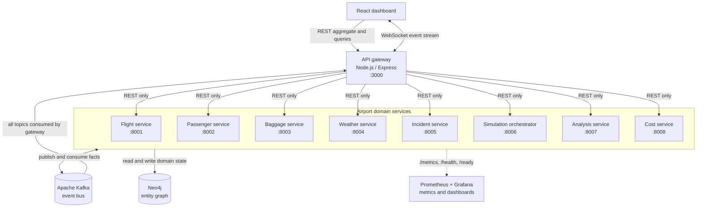
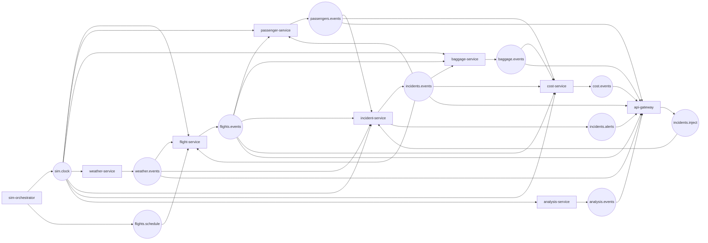
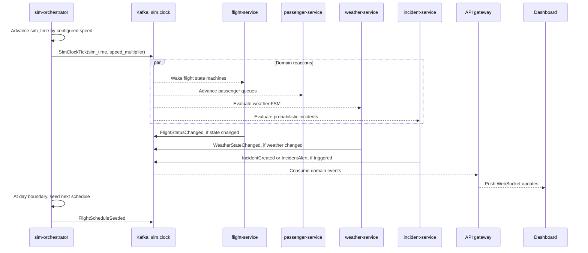
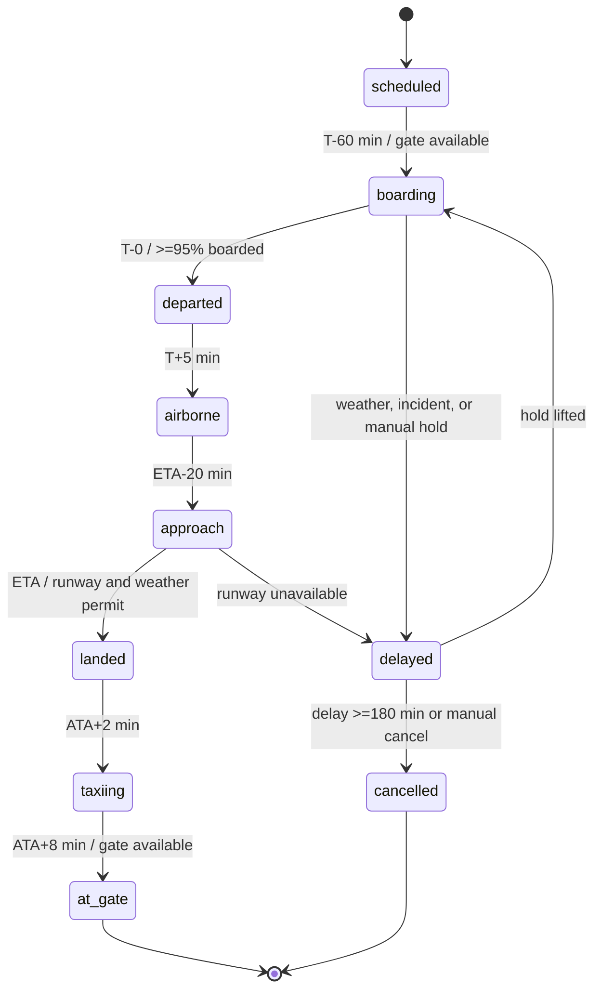
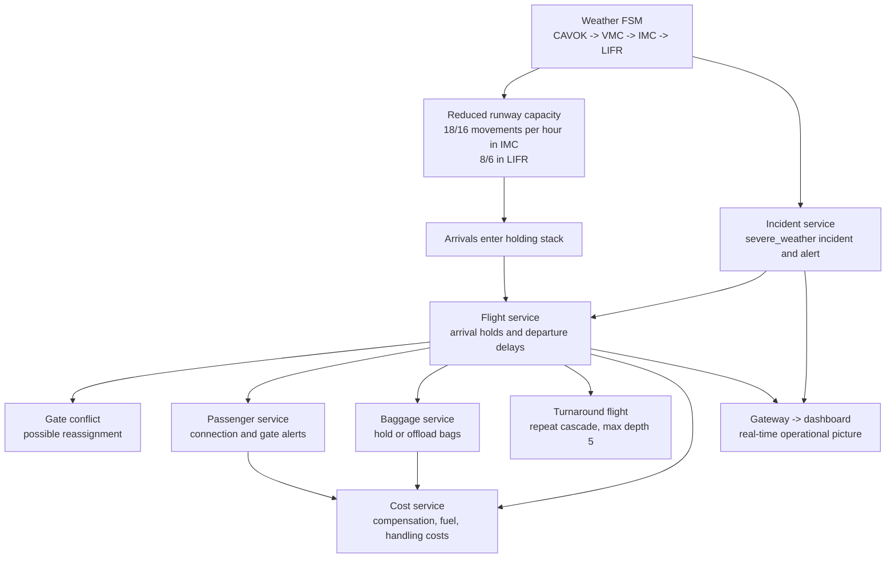
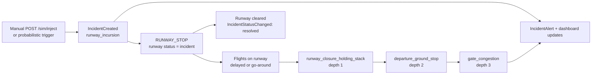
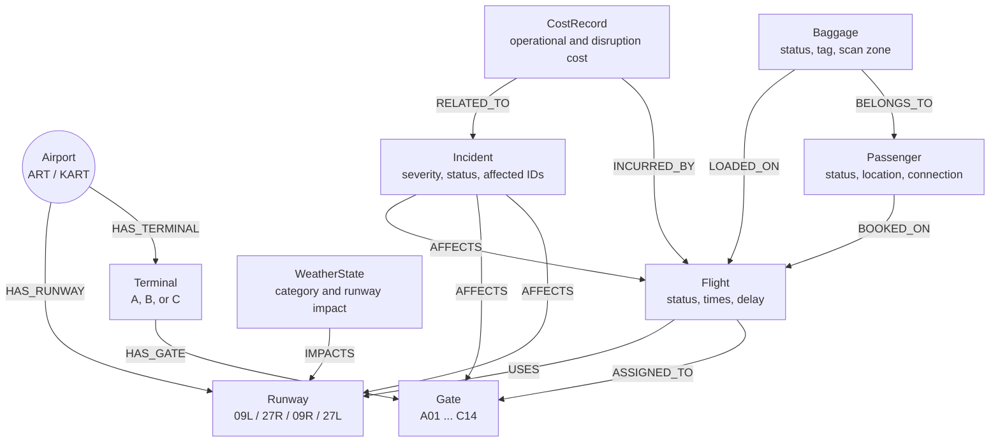

# Architecture plots

This document collects Mermaid diagrams for the Arthur International Airport
digital twin. The diagrams are derived from the architecture, simulation,
event-bus, data-model, and service specifications in `docs/`.

## 1. System architecture

The API gateway is the only synchronous entry point for dashboard clients.
Domain services communicate asynchronously through Kafka and persist their
authoritative entities in Neo4j. Prometheus and Grafana observe the runtime.

## 2. Event-driven communication

Kafka topics are domain-scoped. Producers publish state-change facts, while
each consumer independently updates its own view or forwards events to the
dashboard. The clock topic is broadcast to every service.

## 3. Simulation clock and daily loop

The orchestrator is a conductor rather than an owner of domain state. It
advances virtual time, seeds the next day at the boundary, and lets services
react to the same `SimClockTick` stream.

## 4. Flight lifecycle

Flight transitions are driven by simulated time and constrained by weather,
incidents, runway capacity, gates, and boarding progress.

## 5. Weather cascade into operations

Weather changes reduce runway capacity first. The resulting holding and
sequencing delays can then propagate through flights, gates, passengers,
baggage, and the financial layer.

## 6. Incident cascade example

The incident service turns a local hazard into bounded, observable child
effects. This example follows the documented runway-incursion protocol.

## 7. Neo4j operational graph

Neo4j stores the airport’s structural relationships. These traversals let the
system connect operational state across flights, people, baggage, and
infrastructure.

## Sources

- [`docs/architecture/OVERVIEW.md`](../docs/architecture/OVERVIEW.md)
- [`docs/architecture/EVENT_BUS.md`](../docs/architecture/EVENT_BUS.md)
- [`docs/architecture/DATA_MODEL.md`](../docs/architecture/DATA_MODEL.md)
- [`docs/architecture/SIMULATION.md`](../docs/architecture/SIMULATION.md)
- [`docs/services/flight-service/SPEC.md`](../docs/services/flight-service/SPEC.md)
- [`docs/services/incident-service/SPEC.md`](../docs/services/incident-service/SPEC.md)
- [`docs/services/api-gateway/SPEC.md`](../docs/services/api-gateway/SPEC.md)