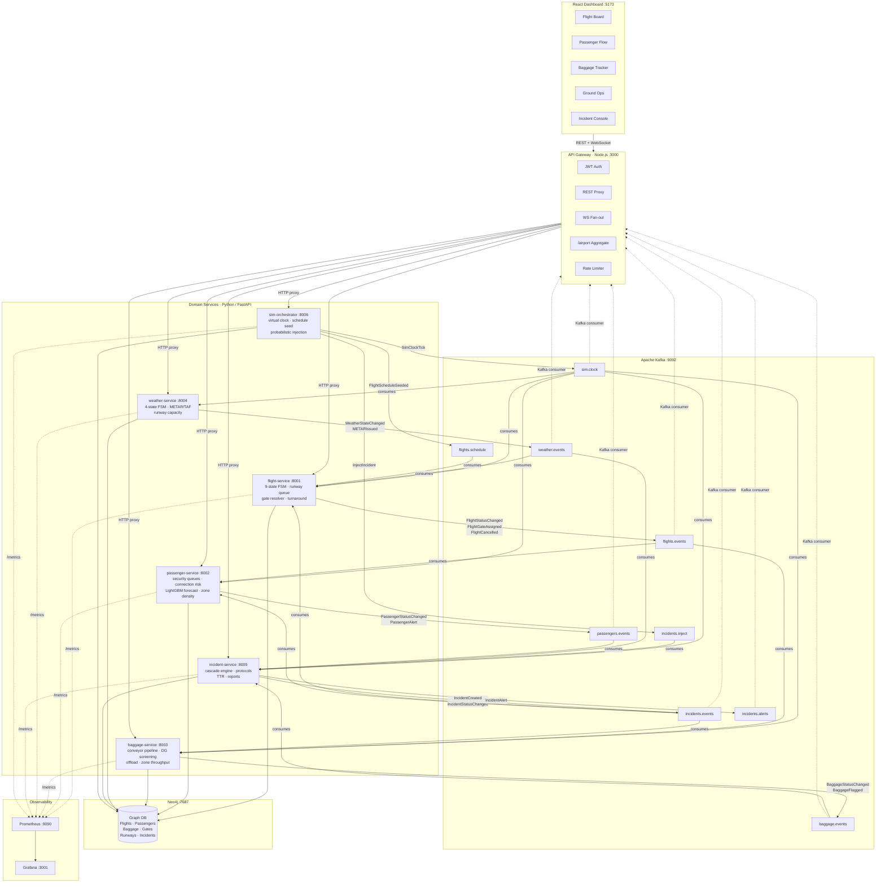
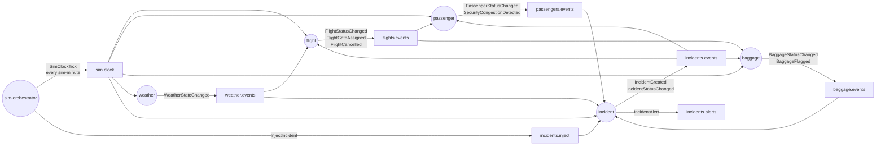
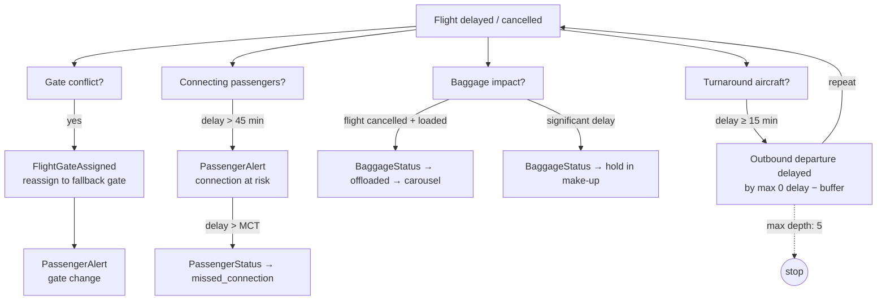
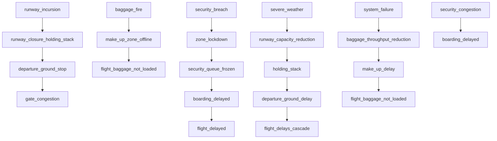
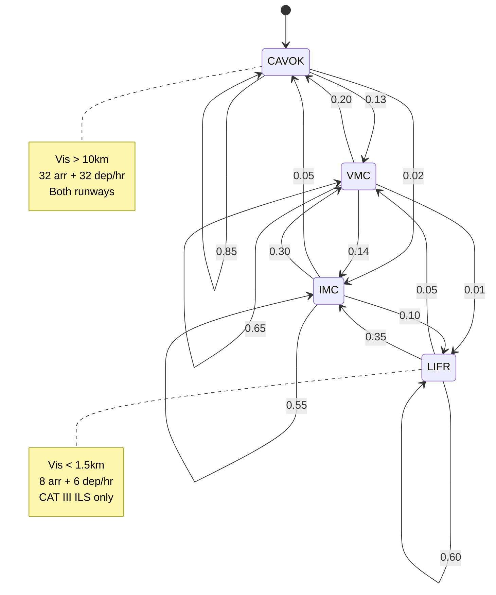
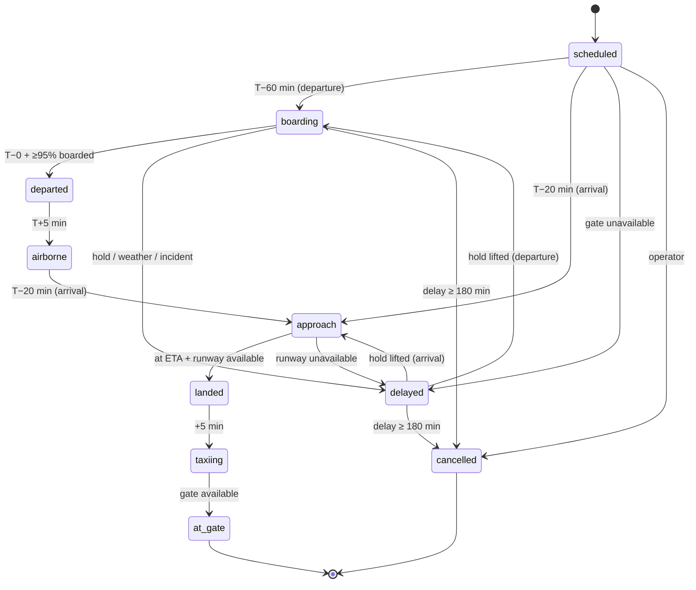
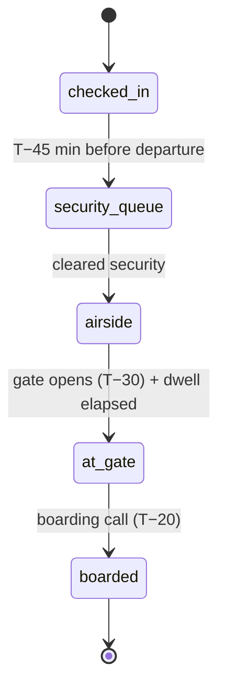
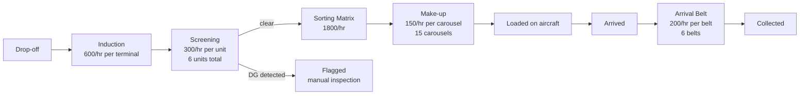

# Architecture diagram

> **Format:** [Mermaid](https://mermaid.js.org/) — renders natively on GitHub and in VS Code with the Mermaid preview extension.

---

## System overview

---

## Kafka event flow

---

## Cascade delay propagation

---

## Incident cascade tree

---

## Weather FSM

---

## Flight state machine

---

## Passenger flow (departure)

---

## Baggage pipeline

